# 开发RESTful风格的应用

## 0 新建工程
### 0.1 新建`maven`项目


### 0.2 配置项目结构


### 0.3 配置Tomcat


### 0.4 修改pom.xml


在`pom.xml`中添加`Spring-MVC`依赖

```xml
<?xml version="1.0" encoding="UTF-8"?>
<project xmlns="http://maven.apache.org/POM/4.0.0"
         xmlns:xsi="http://www.w3.org/2001/XMLSchema-instance"
         xsi:schemaLocation="http://maven.apache.org/POM/4.0.0 http://maven.apache.org/xsd/maven-4.0.0.xsd">
    <modelVersion>4.0.0</modelVersion>

    <groupId>net.kokwind</groupId>
    <artifactId>restful</artifactId>
    <version>1.0-SNAPSHOT</version>

    <repositories>
        <repository>
            <id>aliyun</id>
            <name>Aliyun Maven Repository</name>
            <url>https://https://maven.aliyun.com/repository/public</url>
        </repository>
    </repositories>

    <dependencies>
        <dependency>
            <groupId>org.springframework</groupId>
            <artifactId>spring-webmvc</artifactId>
            <version>5.3.18</version>
        </dependency>
    </dependencies>

    <properties>
        <maven.compiler.source>8</maven.compiler.source>
        <maven.compiler.target>8</maven.compiler.target>
    </properties>

</project>
```


### 0.5 新建applicationContext.xml

在`resources`目录下新建`applicationContext.xml`文件

```xml
<?xml version="1.0" encoding="UTF-8"?>
<beans xmlns="http://www.springframework.org/schema/beans"
       xmlns:mvc="http://www.springframework.org/schema/mvc"
       xmlns:context="http://www.springframework.org/schema/context"
       xmlns:xsi="http://www.w3.org/2001/XMLSchema-instance" xmlns:mv="http://www.springframework.org/schema/mvc"
       xsi:schemaLocation="http://www.springframework.org/schema/beans
            http://www.springframework.org/schema/beans/spring-beans.xsd
            http://www.springframework.org/schema/context
            http://www.springframework.org/schema/context/spring-context.xsd
            http://www.springframework.org/schema/mvc
            http://www.springframework.org/schema/mvc/spring-mvc.xsd">
    <!--
        context:component-scan 标签作用
        在Spring IoC初始化过程中，自动创建并管理net.kokwind.springmvc及子包中
        拥有以下注解的对象。
        @Repository 存放在Dao类上，通常是与数据进行直接交互的类
        @Service 业务逻辑类，通常是放在Service类上
        @Controller 用于描述Spring MVC的控制器类
        @Component  组件，不好区分类型，就使用此注解
    -->
    <context:component-scan base-package="net.kokwind.restful" />
    <!--
        启用Spring的注解开发模式，默认为false
        mvc:annotation-driven 标签作用
        @Controller 用于描述Spring MVC的控制器类
        @RequestMapping 用于描述请求映射
        @ResponseBody 用于描述返回JSON数据
        @RequestParam 用于描述请求参数
        @PathVariable 用于描述请求路径参数
        @ModelAttribute 用于描述请求参数
        @SessionAttributes 用于描述Session属性
        @ExceptionHandler 用于描述异常处理
        @InitBinder 用于描述请求参数绑定
        @PreHandle 用于描述请求参数绑定
        @PostHandle 用于描述请求参数绑定
        @AfterHandle 用于描述请求参数绑定
        @PreHandle 用于描述请求参数绑定
        @PostHandle 用于描述请求参数绑定
        @AfterHandle 用于描述请求参数绑定
      -->
    <mvc:annotation-driven conversion-service="conversionService">
        <mvc:message-converters>
            <bean class="org.springframework.http.converter.StringHttpMessageConverter">
                <property name="supportedMediaTypes">
                    <list>
                        <value>text/plain;charset=UTF-8</value>
                        <value>text/html;charset=UTF-8</value>
                        <value>text/xml;charset=UTF-8</value>
                        <value>application/json;charset=UTF-8</value>
                    </list>
                </property>
            </bean>
        </mvc:message-converters>
    </mvc:annotation-driven>
    <!-- 将图片/JS/CSS等静态资源排除在外，可提高执行效率 -->
    <mvc:default-servlet-handler/>

    <bean id="conversionService" class="org.springframework.format.support.FormattingConversionServiceFactoryBean">
        <property name="converters">
            <set>
                <bean class="net.kokwind.restful.converter.MyDateConverter"/>
            </set>
        </property>
    </bean>

</beans>
```

### 0.6 新建MyDateConverter日期转换

新建`net.kokwind.restful.converter`包
新建`MyDateConverter`类

```java
package net.kokwind.restful.converter;

import org.springframework.core.convert.converter.Converter;

import java.text.ParseException;
import java.text.SimpleDateFormat;
import java.util.Date;

public class MyDateConverter implements Converter<String, Date> {
    public Date convert(String s) {
        SimpleDateFormat sdf = new SimpleDateFormat("yyyy-MM-dd");
        try {
            Date d = sdf.parse(s);
            return d;
        } catch (ParseException e) {
            e.printStackTrace();
            return null;
        }
    }
}
```

### 0.7 配置web.xml

在`web.xml`中添加`spring-mvc`的配置

```xml
<?xml version="1.0" encoding="UTF-8"?>
<web-app xmlns="http://xmlns.jcp.org/xml/ns/javaee"
         xmlns:xsi="http://www.w3.org/2001/XMLSchema-instance"
         xsi:schemaLocation="http://xmlns.jcp.org/xml/ns/javaee http://xmlns.jcp.org/xml/ns/javaee/web-app_4_0.xsd"
         version="4.0">
    <!--DispatchServlet -->
    <servlet>
        <servlet-name>springmvc</servlet-name>
        <!--
            DispatcherServlet是Spring MVC最核心的对象
            DispatcherServlet用于拦截Http请求，
            并根据请求的URL调用相应的Controller方法进行Http请求的处理
         -->
        <servlet-class>org.springframework.web.servlet.DispatcherServlet</servlet-class>
        <!-- 配置IoC容器的xml文件存放位置 -->
        <init-param>
            <param-name>contextConfigLocation</param-name>
            <param-value>classpath:applicationContext.xml</param-value>
        </init-param>
        <!--
            在web应用启动时自动创建Spring IOC容器，
            并初始化DispatcherServlet
         -->
        <load-on-startup>0</load-on-startup>
    </servlet>
    <!-- ServletMapping -->
    <servlet-mapping>
        <servlet-name>springmvc</servlet-name>
        <!-- "/"代表拦截所有请求 -->
        <url-pattern>/</url-pattern>
    </servlet-mapping>
    <!-- 对post请求所有的字符集转换为utf-8-->
    <filter>
        <filter-name>characterFilter</filter-name>
        <filter-class>org.springframework.web.filter.CharacterEncodingFilter</filter-class>
        <init-param>
            <param-name>encoding</param-name>
            <param-value>UTF-8</param-value>
        </init-param>
    </filter>
    <filter-mapping>
        <filter-name>characterFilter</filter-name>
        <url-pattern>/*</url-pattern>
    </filter-mapping>

</web-app>
```

## 1. 开发一个简单的RESTful应用
### 1.1 传统的Web应用模式

是通过浏览器等通过http协议来请求数据，但是随着时代的发展又多了APP和微信小程序之间的交互，这种客户端是不支持html的。


### 1.2 RESTful的开发风格
RESTful是一种编码的风格，它的目的是为了提供一种简单的方式来描述网络资源的变化
要返回xml或者json格式的数据。


### 1.3 RESTful开发规范

- 使用URL作为用户交互入口
- 明确的予以规范(比如：GET、POST、PUT、DELETE)
- 只返回数据(JSON|XML),不包含任何展现


### 1.4 简单的示例

新建软件包`net.kokwind.restful.controller`

```java
package net.kokwind.restful.controller;

import org.springframework.stereotype.Controller;
import org.springframework.web.bind.annotation.GetMapping;
import org.springframework.web.bind.annotation.RequestMapping;
import org.springframework.web.bind.annotation.ResponseBody;

@Controller
@RequestMapping("/restful")
public class RestfulController {
    @GetMapping("/request")
    @ResponseBody
    public String doGetRequest() {
        //双引号中如果包含双引号，要使用转移字符\来转义
        return "{\"message\":\"返回查询结果\"}";
    }
}
```
添加web依赖


打开网页


### 1.5 Web应用

我们可以在程序中通过AJAX得到和URL交互得到数据。
异步与URL发送请求，同时得到响应结果。

添加`jquery.js`支持发送AJAX请求

新建`client.html`
```html
<!DOCTYPE html>
<html lang="en">
<head>
    <meta charset="UTF-8">
    <title>RESTful实验室</title>
    <script src="jquery-3.3.1.min.js"></script>
    <script>
        $(function(){
            $("#btnGet").click(function(){
                $.ajax({
                    url:"/restful/request",
                    type:"get",
                    dataType:"json",
                    success:function(json){
                        $("#message").text(json.message);
                    }
                })
            })
        })
    </script>
</head>
<body>
    <input type="button" id="btnGet" value="发送Get请求">
    <h1 id="message"></h1>
</body>
</html>
```

打开网页


对应的添加`post,put,delete`请求
```java
package net.kokwind.restful.controller;

import org.springframework.stereotype.Controller;
import org.springframework.web.bind.annotation.*;

@Controller
@RequestMapping("/restful")
public class RestfulController {
    @GetMapping("/request")
    @ResponseBody
    public String doGetRequest() {
        //双引号中如果包含双引号，要使用转移字符\来转义
        return "{\"message\":\"返回查询结果\"}";
    }

    @PostMapping ("/request")
    @ResponseBody
    public String doPostRequest() {
        //双引号中如果包含双引号，要使用转移字符\来转义
        return "{\"message\":\"数据新建成功\"}";
    }

    @PutMapping ("/request")
    @ResponseBody
    public String doPutRequest() {
        //双引号中如果包含双引号，要使用转移字符\来转义
        return "{\"message\":\"数据更新成功\"}";
    }

    @DeleteMapping("/request")
    @ResponseBody
    public String doDeleteRequest() {
        //双引号中如果包含双引号，要使用转移字符\来转义
        return "{\"message\":\"数据删除成功\"}";
    }
}
```

修改网页文件

```html
<!DOCTYPE html>
<html lang="en">
<head>
    <meta charset="UTF-8">
    <title>RESTful实验室</title>
    <script src="jquery-3.3.1.min.js"></script>
    <script>
        $(function(){
            $("#btnGet").click(function(){
                $.ajax({
                    url:"/restful/request",
                    type:"get",
                    dataType:"json",
                    success:function(json){
                        $("#message").text(json.message);
                    }
                })
            })
        })

        $(function(){
            $("#btnPost").click(function(){
                $.ajax({
                    url:"/restful/request",
                    type:"post",
                    dataType:"json",
                    success:function(json){
                        $("#message").text(json.message);
                    }
                })
            })
        })

        $(function(){
            $("#btnPut").click(function(){
                $.ajax({
                    url:"/restful/request",
                    type:"put",
                    dataType:"json",
                    success:function(json){
                        $("#message").text(json.message);
                    }
                })
            })
        })

        $(function(){
            $("#btnDelete").click(function(){
                $.ajax({
                    url:"/restful/request",
                    type:"delete",
                    dataType:"json",
                    success:function(json){
                        $("#message").text(json.message);
                    }
                })
            })
        })
    </script>
</head>
<body>
<input type="button" id="btnGet" value="发送Get请求">
<input type="button" id="btnPost" value="发送post请求">
<input type="button" id="btnPut" value="发送Put请求">
<input type="button" id="btnDelete" value="发送Delete请求">
<h1 id="message"></h1>
</body>
</html>
```

打开网页


### 1.6 提交到github
在github新建一个`repository`
在项目工程目录下执行`git`命令，提交到github

```shell
git commit -m "first commit"
git branch -M main
git remote add origin git@github.com:onezos/restful.git
git push -u origin main
```


### 1.7 RestController注解与路径变量
通过`@RestController`注解，可以将该类设置为RestController，这样该类的所有方法都会被返回json数据，
这样不需要在每个方法上都使用`@ResponseBody`注解了。

而发送`post /restful/request/100`类似请求，需要使用`/request/{rid}`的形式来指定参数，并在参数名前加上`@PathVariable`注解。
```java
package net.kokwind.restful.controller;

import org.springframework.web.bind.annotation.*;

@RestController
@RequestMapping("/restful")
public class RestfulController {
    @GetMapping("/request")
    public String doGetRequest() {
        //双引号中如果包含双引号，要使用转移字符\来转义
        return "{\"message\":\"返回查询结果\"}";
    }

    // 发送post /restful/request/100请求
    @PostMapping ("/request/{rid}")
    public String doPostRequest(@PathVariable("rid") Integer requestId) {
        //双引号中如果包含双引号，要使用转移字符\来转义
        return "{\"message\":\"数据新建成功\",\"id\":"   + requestId + "}";
    }

    @PutMapping ("/request")
    public String doPutRequest() {
        //双引号中如果包含双引号，要使用转移字符\来转义
        return "{\"message\":\"数据更新成功\"}";
    }

    @DeleteMapping("/request")
    public String doDeleteRequest() {
        //双引号中如果包含双引号，要使用转移字符\来转义
        return "{\"message\":\"数据删除成功\"}";
    }
}

```
打开网页测试：


提交到github


### 1.8 简单请求与非简单请求

- 简单请求是指标准结构的HTTP请求，对应GET/POST请求
- 非简单请求时复杂要求的HTTP请求，指PUT/DELETE、扩展标准请求
- 两者最大区别是非简单请求发送前需要发送预检请求


修改程序来演示一下
新建`Person`实体类
```java
package net.kokwind.restful.entity;

public class Person {
    private String name;
    private Integer age;

    public String getName() {
        return name;
    }

    public void setName(String name) {
        this.name = name;
    }

    public Integer getAge() {
        return age;
    }

    public void setAge(Integer age) {
        this.age = age;
    }
}

```
添加传递参数
```java
package net.kokwind.restful.controller;

import net.kokwind.restful.entity.Person;
import org.springframework.web.bind.annotation.*;

@RestController
@RequestMapping("/restful")
public class RestfulController {
    @GetMapping("/request")
    public String doGetRequest() {
        //双引号中如果包含双引号，要使用转移字符\来转义
        return "{\"message\":\"返回查询结果\"}";
    }

    // 发送post /restful/request/100请求
    @PostMapping ("/request/{rid}")
    public String doPostRequest(@PathVariable("rid") Integer requestId, Person person) {
        System.out.println(person.getName() + ":" + person.getAge());
        //双引号中如果包含双引号，要使用转移字符\来转义
        return "{\"message\":\"数据新建成功\",\"id\":"   + requestId + "}";
    }

    @PutMapping ("/request")
    public String doPutRequest(Person person) {
        System.out.println(person.getName() + ":" + person.getAge());
        //双引号中如果包含双引号，要使用转移字符\来转义
        return "{\"message\":\"数据更新成功\"}";
    }

    @DeleteMapping("/request")
    public String doDeleteRequest() {
        //双引号中如果包含双引号，要使用转移字符\来转义
        return "{\"message\":\"数据删除成功\"}";
    }
}

```
网页文件里添加`data:"name=zhangsan&age=20",`
```html
        $(function(){
            $("#btnPost").click(function(){
                $.ajax({
                    url:"/restful/request/100",
                    type:"post",
                    data:"name=zhangsan&age=20",
                    dataType:"json",
                    success:function(json){
                        $("#message").text(json.message + " " + json.id);
                    }
                })
            })
        })

        $(function(){
            $("#btnPut").click(function(){
                $.ajax({
                    url:"/restful/request",
                    type:"put",
                    data:"name=zhangsan&age=20",
                    dataType:"json",
                    success:function(json){
                        $("#message").text(json.message);
                    }
                })
            })
        })
```
打开网页测试


控制台输出，简单请求是可以直接得到数据的，而PUT得到的数据却是`null`
```
zhangsan:20
null:null
```

我们需要在`web.xml`添加filter，来支持非简单请求
```xml
    <!-- 支持PUT/DELETE预处理 -->
    <filter>
        <filter-name>formContentFilter</filter-name>
        <filter-class>org.springframework.web.filter.FormContentFilter</filter-class>
    </filter>
    <filter-mapping>
        <filter-name>formContentFilter</filter-name>
        <url-pattern>/*</url-pattern>
    </filter-mapping>
```

再次启动就可以正常得到数据了。


### 1.9 JSON序列化

#### 1.9.1 添加JSON依赖

首先在`pom.xml`中添加`jackson`依赖

```xml
        <dependency>
            <groupId>com.fasterxml.jackson.core</groupId>
            <artifactId>jackson-core</artifactId>
            <version>2.13.1</version>
        </dependency>
        <dependency>
            <groupId>com.fasterxml.jackson.core</groupId>
            <artifactId>jackson-databind</artifactId>
            <version>2.13.1</version>
        </dependency>
        <dependency>
            <groupId>com.fasterxml.jackson.core</groupId>
            <artifactId>jackson-annotations</artifactId>
            <version>2.13.1</version>
        </dependency>
```

#### 1.9.2 新增请求单一数据的方法

新建一个方法`getPerson`,返回一个Person对象,之所以没有使用`ModelAndView`，是因为在SpringMVC中，
如果返回的是实体对象并且使用了`@RestController`注解，并且配置了`jackson`，
那么SpringMVC会自动将返回的对象序列化为JSON格式。

```java
    @GetMapping("/person")
    public Person getPerson(Integer id) {
        Person person = new Person();
        if(id == 1) {
            person.setName("kokwind");
            person.setAge(18);

        } else if(id == 2) {
            person.setName("kong");
            person.setAge(20);
        }
        return person;
    }
```

如果外部库中没有`jackson`,就需要手动重新加载一下。

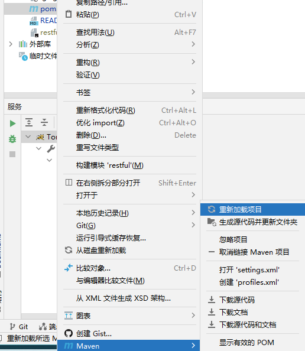

然后放到输出目录中


启动Tomcat，打开网页测试


#### 1.9.3 新增请求多个数据的方法

当请求的是多个对象时，使用List就可以了。

```java
    @GetMapping("/persons")
    public List<Person> getPersons() {
        List list = new ArrayList();
        Person p1 = new Person();
        p1.setName("kokwind");
        p1.setAge(18);
        list.add(p1);
        Person p2 = new Person();
        p2.setName("kong");
        p2.setAge(20);
        list.add(p2);
        return list;
    }
```


接着修改网页文件，添加一个按钮
```html
<body>
    <input type="button" id="btnGet" value="发送Get请求">
    <input type="button" id="btnPost" value="发送post请求">
    <input type="button" id="btnPut" value="发送Put请求">
    <input type="button" id="btnDelete" value="发送Delete请求">
    <h1 id="message"></h1>
    <hr>
    <input type="button" id="btnPersons" value="请求所有Person数据">
</body>
```
添加对应的点击事件
```javascript
        $(function(){
            $("#btnPersons").click(function(){
                $.ajax({
                    url:"/restful/persons",
                    type:"get",
                    dataType:"json",
                    success:function(json){
                        console.info(json);
                    }
                })
            })
        })
```

打开网页查看结果


在控制台可以看到输出的结果


#### 1.9.4 jackson对时间的处理
当使用jackson时，出现日期时间的数据，默认从1970年开始算起，需要设置时间格式，
通过添加`@JsonFormat`注解，可以设置时间格式。
```java
package net.kokwind.restful.entity;

import com.fasterxml.jackson.annotation.JsonFormat;

import java.util.Date;

public class Person {
    private String name;
    private Integer age;
    @JsonFormat(pattern = "yyyy-MM-dd HH:mm:ss", timezone = "GMT+8")
    private Date birthday;

    public Person() {
    }

    public Person(String name, Integer age, Date birthday) {
        this.name = name;
        this.age = age;
        this.birthday = birthday;
    }

    public String getName() {
        return name;
    }

    public void setName(String name) {
        this.name = name;
    }

    public Integer getAge() {
        return age;
    }

    public void setAge(Integer age) {
        this.age = age;
    }

    public Date getBirthday() {
        return birthday;
    }

    public void setBirthday(Date birthday) {
        this.birthday = birthday;
    }
}
```

在网页中增加日期的输出
```javascript
$("#divPersons").append("<h2>" + p.name + " - " + p.age + " - " + p.birthday +"</h2>");
```

方法中添加生日
```java
p1.setBirthday(new Date());
```

结果输出如下

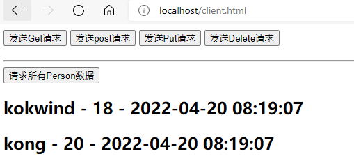


## 2 浏览器的同源策略

- 同源策略阻止从一个域加载的脚本去获取另一个域上的资源

- 只要协议、域名、端口有任何一个不同，都被当错时不同的域名

- 浏览器Console看到Access-Control-Allow-Origin就代表跨域了


### 2.1 HTML中允许跨域的标签

- `` - 显示远程图片
- `<scipt>` - 加载远程JS
- `<link>` - 加载远程CSS


### 2.2 CORS跨域资源访问

- CORS是一种机制，使用额外的HTTP头通知浏览器可以访问其它域
- URL响应头包含Access-Control-*置名请求允许跨域


### 2.3 Spring MVC解决跨域访问

- `@CrossOrigin` - Controller跨域注解
- `<mvc:cors>` - Spring MVC全局跨域配置


### 2.4 实现跨域访问

复制一份restful工程起名为restful8080

修改配置

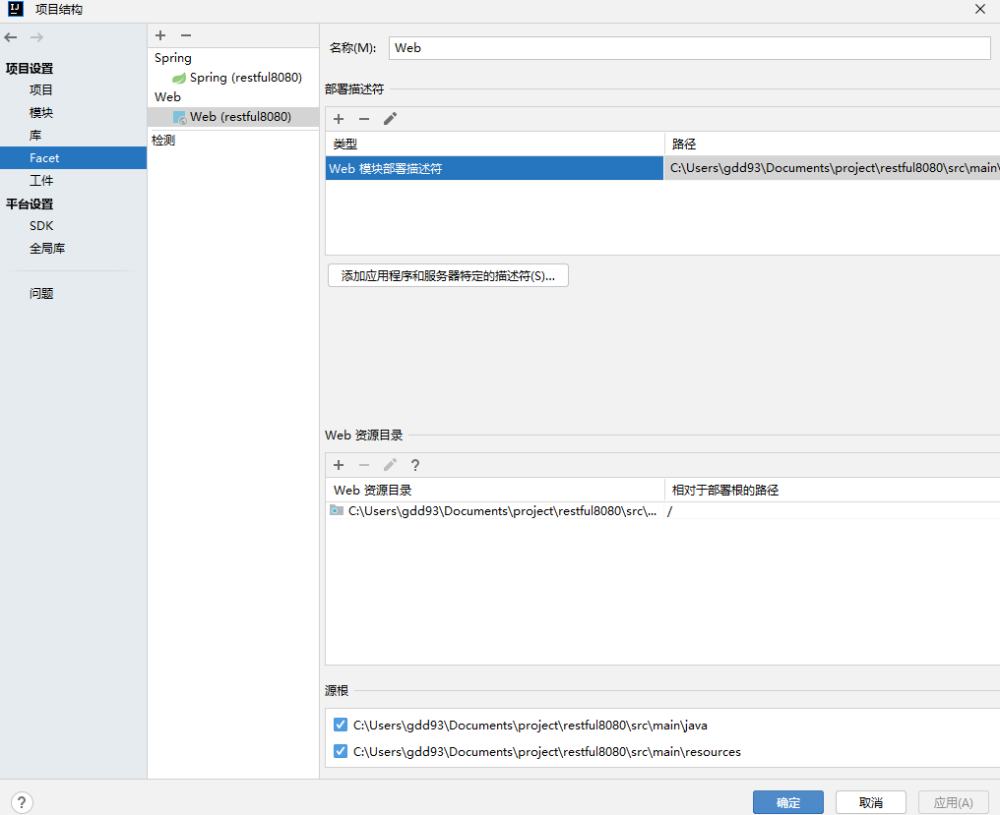


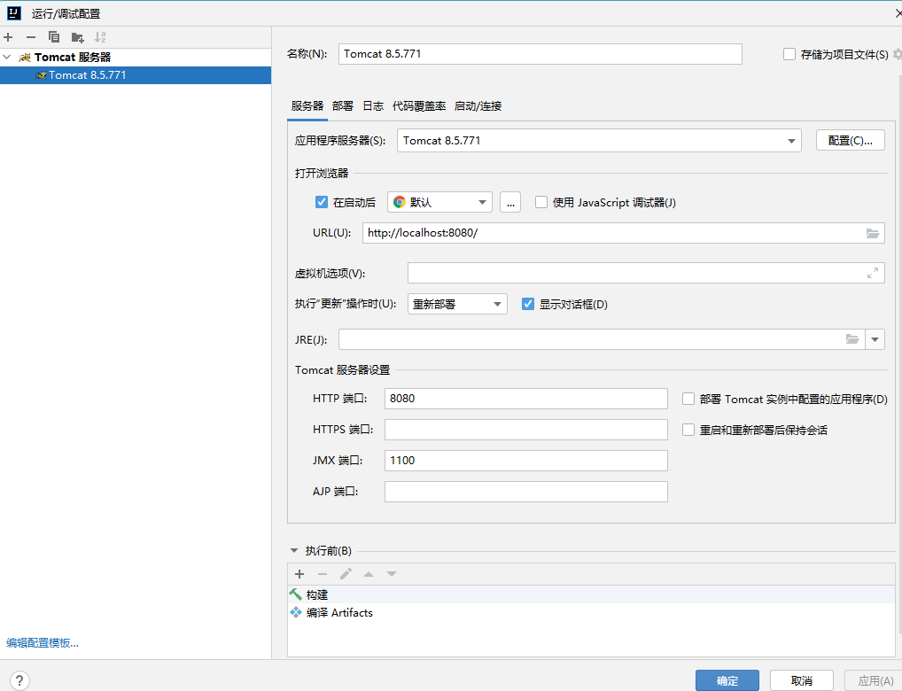

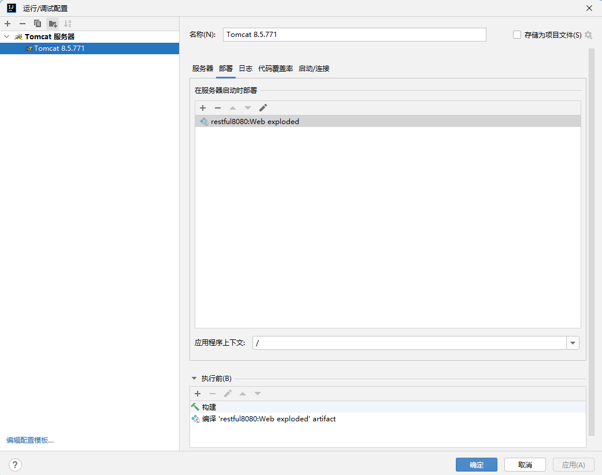

 修改请求代码
```javascript
        $(function(){
            $("#btnPersons").click(function(){
                $.ajax({
                    url:"http://localhost/restful/persons",
                    type:"get",
                    dataType:"json",
                    success:function(json){
                        console.info(json);
                        for(var i = 0; i < json.length; i++){
                            var p = json[i];
                            $("#divPersons").append("<h2>" + p.name + " - " + p.age + " - " + p.birthday +"</h2>");
                        }
                    }
                })
            })
        })
```

启动restful的Tomcat，端口80
启动restful8080的Tomcat，端口8080

打开网页


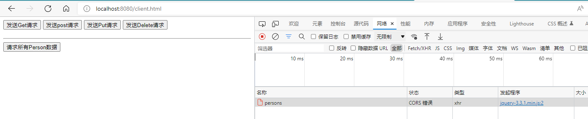


看到`No 'Access-Control-Allow-Origin'`就代表不支持跨域访问


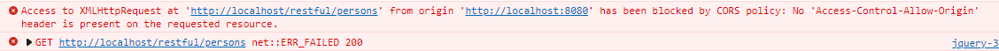


要想支持跨域，只需要添加`@CrossOrigin`注解即可

修改restful控制器的代码

```java
package net.kokwind.restful.controller;

import net.kokwind.restful.entity.Person;
import org.springframework.web.bind.annotation.*;

import java.util.ArrayList;
import java.util.Date;
import java.util.List;

@RestController
@RequestMapping("/restful")
//maxAge是预检请求缓存时间，一小时内PUT/DELETE请求不会再次发送预检请求，maxAge=0表示不缓存，maxAge<0表示不缓存，maxAge>0表示缓存多少秒，默认是-1
@CrossOrigin(origins = "http://localhost:8080", maxAge = 3600)
public class RestfulController {
    @GetMapping("/request")
    public String doGetRequest() {
        //双引号中如果包含双引号，要使用转移字符\来转义
        return "{\"message\":\"返回查询结果\"}";
    }

    // 发送post /restful/request/100请求
    @PostMapping ("/request/{rid}")
    public String doPostRequest(@PathVariable("rid") Integer requestId, Person person) {
        System.out.println(person.getName() + ":" + person.getAge());
        //双引号中如果包含双引号，要使用转移字符\来转义
        return "{\"message\":\"数据新建成功\",\"id\":"   + requestId + "}";
    }

    @PutMapping ("/request")
    public String doPutRequest(Person person) {
        System.out.println(person.getName() + ":" + person.getAge());
        //双引号中如果包含双引号，要使用转移字符\来转义
        return "{\"message\":\"数据更新成功\"}";
    }

    @DeleteMapping("/request")
    public String doDeleteRequest() {
        //双引号中如果包含双引号，要使用转移字符\来转义
        return "{\"message\":\"数据删除成功\"}";
    }

    @GetMapping("/person")
    public Person getPerson(Integer id) {
        Person person = new Person();
        if(id == 1) {
            person.setName("kokwind");
            person.setAge(18);

        } else if(id == 2) {
            person.setName("kong");
            person.setAge(20);
        }
        return person;
    }

    @GetMapping("/persons")
    public List<Person> getPersons() {
        List list = new ArrayList();
        Person p1 = new Person();
        p1.setName("kokwind");
        p1.setAge(18);
        p1.setBirthday(new Date());
        list.add(p1);
        Person p2 = new Person();
        p2.setName("kong");
        p2.setAge(20);
        p2.setBirthday(new Date());
        list.add(p2);
        return list;
    }
}

```

重启Tomcat，打开网页再次测试，就可以取得数据了

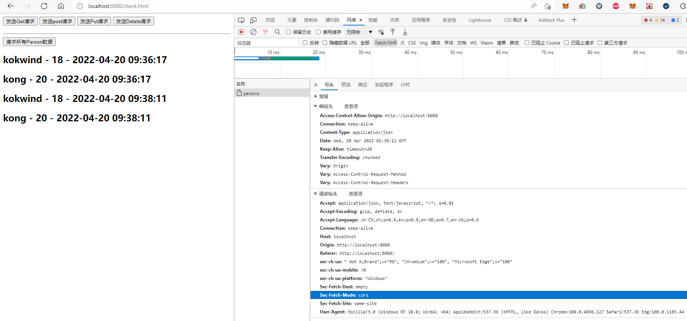

在请求头中看到`Sec-Fetch-Mode: cors`说明我这个请求要跨域访问了。
而restful项目中增加了支持跨域的注解，所以响应的时候就会验证是否允许`Vary: Access-Control-Request-Method`。


### 2.5 跨域请求的全局配置

只需要在`applicationCcontext.xml`中添加`<mvc:cors>`即可

```xml
    <!-- 跨域访问全局配置 -->
    <mvc:cors>
        <mvc:mapping path="/restful/**"
                    allowed-origins="http://localhost:8080,http://www.kokwind.net"
                    max-age="3600"/>
    </mvc:cors>
```

在restful中注释掉`//@CrossOrigin(origins = "http://localhost:8080", maxAge = 3600)`

打开网页测试

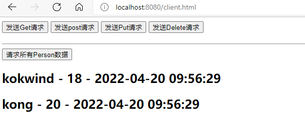


## 3 拦截器 - Interceptor

- 拦截器（Interceptor）用于对URL请求进行前置/后置过滤
- Interceptor与Filter用途类似，但实现方式不同
  - Interceptor是Spring MVC的标准组件，创建以后是运行在IoC容器中的
  - Filter是J2EE的标准组件

- Interceptor底层就是基于Spring AOP面向切面编程实现


### 3.1 拦截器开发流程

- Maven依赖servlet-api
- 实现HandlerInterceptor接口
- applicationContext配置过滤地址


#### 3.1.1 Maven依赖servlet-api

```xml
        <!-- 增加拦截器依赖， provided代表只有在开发编译才会引用，打包会排除在外 -->
        <dependency>
            <groupId>javax.servlet</groupId>
            <artifactId>javax.servlet-api</artifactId>
            <version>3.1.0</version>
            <scope>provided</scope>
        </dependency>
```

#### 3.1.2 实现HandlerInterceptor接口

使用快捷键alt+del打开


也可以直接用ctrl+i


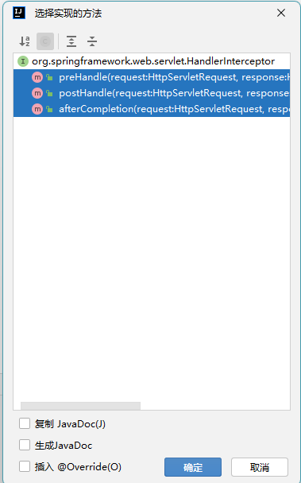


- preHandle - 前置执行处理
- postHandle - 目标资源已被Spring MVC框架处理
- afterCompletion - 响应wen'ben

新建interceptor包
新建MyInterceptor类

```java
package net.kokwind.restful.interceptor;

import org.springframework.web.servlet.HandlerInterceptor;
import org.springframework.web.servlet.ModelAndView;

import javax.servlet.http.HttpServletRequest;
import javax.servlet.http.HttpServletResponse;

public class MyInterceptor implements HandlerInterceptor {
    public boolean preHandle(HttpServletRequest request, HttpServletResponse response, Object handler) throws Exception {
        System.out.println(request.getRequestURL() + "- 准备执行");
        return true;
    }

    //当目标的URL被处理完了后就会执行这个方法
    public void postHandle(HttpServletRequest request, HttpServletResponse response, Object handler, ModelAndView modelAndView) throws Exception {
        System.out.println(request.getRequestURL() + "- 目标处理成功");
    }
    
    //当目标的URL响应文本产生以后就会执行这个方法
    public void afterCompletion(HttpServletRequest request, HttpServletResponse response, Object handler, Exception ex) throws Exception {
        System.out.println(request.getRequestURL() + "- 响应内容已产生");
    }
}
```

#### 3.1.3 applicationContext配置过滤地址

```xml
    <!-- 拦截器配置 -->
    <mvc:interceptors>
        <mvc:interceptor>
            <mvc:mapping path="/restful/**"/>
            <mvc:mapping path="/webapi/**"/>
            <mvc:exclude-mapping path="/**.ico"/>
            <mvc:exclude-mapping path="/**.jpg"/>
            <mvc:exclude-mapping path="/**.gif"/>
            <mvc:exclude-mapping path="/**.js"/>
            <mvc:exclude-mapping path="/**.css"/>
            <mvc:exclude-mapping path="/resources/**"/>
            <bean class="net.kokwind.restful.interceptor.MyInterceptor"/>
        </mvc:interceptor>
    </mvc:interceptors>

```

### 3.2 拦截器的使用

打开网页测试

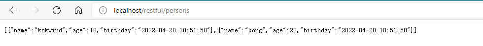

控制台输出

```
http://localhost/restful/persons- 准备执行
http://localhost/restful/persons- 目标处理成功
http://localhost/restful/persons- 响应内容已产生
```


### 3.3 开发用户流量拦截器
#### 3.3.1 增加logback日志输出
在`pom.xml`中增加`logback-classic`依赖
```xml
        <!-- 增加日志输出 -->
        <dependency>
            <groupId>ch.qos.logback</groupId>
            <artifactId>logback-classic</artifactId>
            <version>1.2.11</version>
        </dependency>
```

在`resources`新建`logback.xml`配置文件

```xml
<?xml version="1.0" encoding="UTF-8"?>
<configuration>
  <!-- 日志输出主体格式配置 -->
  <appender name="console" class="ch.qos.logback.core.ConsoleAppender">
    <encoder>
      <pattern>[%thread] %d %level %logger{10} - %msg%n</pattern>
    </encoder>
  </appender>
  <!-- 日志输出级别 -->
  <root level="debug">
    <appender-ref ref="console"/>
  </root>
</configuration>
```

如果想要增加日志存储，继续添加配置。

```xml
    <!-- 存储日志 -->
    <appender name="accessHistoryLog" class="ch.qos.logback.core.rolling.RollingFileAppender">
        <rollingPolicy class="ch.qos.logback.core.rolling.TimeBasedRollingPolicy">
            <fileNamePattern>d:/logs/history.%d.log</fileNamePattern>
        </rollingPolicy>
        <encoder>
            <pattern>[%thread] %d %level %logger{10} - %msg%n</pattern>
        </encoder>
    </appender>
```
要想使它生效，需要添加logger配置。注明哪个类使用本地日志。
`additivity="false"`表示写入文件的日志，不重复输出到控制台。

```xml
    <logger name="net.kokwind.restful.interceptor.AccessHistoryInterception"
            level="INFO" additivity="false">
        <appender-ref ref="accessHistoryLog"/>
    </logger>
```


#### 3.3.2 配合拦截器配置logback日志输出

新建软件包`interceptor`

新建类`AccessHistoryInterception`

```java
package net.kokwind.restful.interceptor;

import org.slf4j.Logger;
import org.slf4j.LoggerFactory;
import org.springframework.web.servlet.HandlerInterceptor;

import javax.servlet.http.HttpServletRequest;
import javax.servlet.http.HttpServletResponse;

public class AccessHistoryInterception implements HandlerInterceptor {
    //用户请求拦截，分析用户信息，记录用户访问记录
    private Logger logger = LoggerFactory.getLogger(AccessHistoryInterception.class);

    public boolean preHandle(HttpServletRequest request, HttpServletResponse response, Object handler) throws Exception {
        //控制log输出内容
        StringBuilder log = new StringBuilder();
        //获取用户的IP地址
        log.append(request.getRemoteAddr());
        //分割线
        log.append("|");
        //获取用户的浏览器信息
        log.append(request.getHeader("User-Agent"));
        //分割线
        log.append("|");
        //获取用户的请求URL
        log.append(request.getRequestURL());
        logger.info(log.toString());
        return true;
    }
}
```


在`applicationContext.xml`配置`interceptor`

```xml
    <mvc:interceptors>
        <mvc:interceptor>
            <mvc:mapping path="/**"/>
            <mvc:exclude-mapping path="/resources/**"/>
            <bean class="net.kokwind.restful.interceptor.AccessHistoryInterception"/>
        </mvc:interceptor>
    </mvc:interceptors>
```

重启Tomcat进行测试

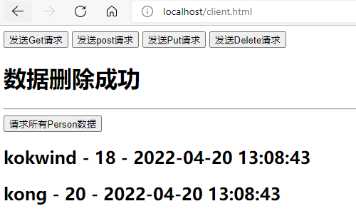

本地也看到输出的日志文件

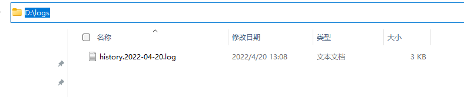

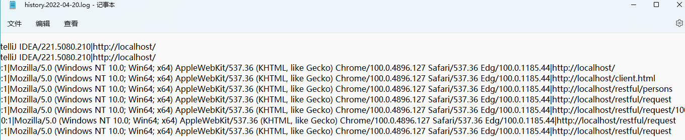


## 4 Spring MVC处理流程

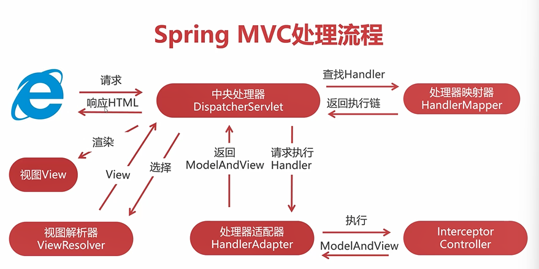

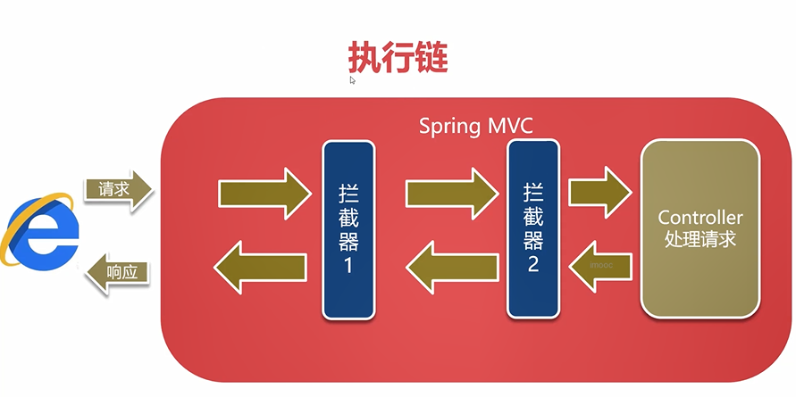

