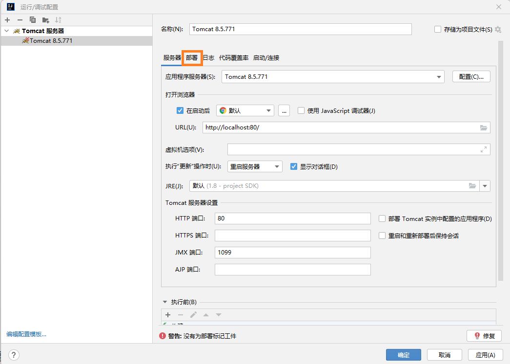

# 开发RESTful风格的应用

## 0 新建工程
### 0.1 新建`maven`项目


### 0.2 配置项目结构


### 0.3 配置Tomcat





### 0.4 修改pom.xml


在`pom.xml`中添加`Spring-MVC`依赖

```xml
<?xml version="1.0" encoding="UTF-8"?>
<project xmlns="http://maven.apache.org/POM/4.0.0"
         xmlns:xsi="http://www.w3.org/2001/XMLSchema-instance"
         xsi:schemaLocation="http://maven.apache.org/POM/4.0.0 http://maven.apache.org/xsd/maven-4.0.0.xsd">
    <modelVersion>4.0.0</modelVersion>

    <groupId>net.kokwind</groupId>
    <artifactId>restful</artifactId>
    <version>1.0-SNAPSHOT</version>

    <repositories>
        <repository>
            <id>aliyun</id>
            <name>Aliyun Maven Repository</name>
            <url>https://https://maven.aliyun.com/repository/public</url>
        </repository>
    </repositories>

    <dependencies>
        <dependency>
            <groupId>org.springframework</groupId>
            <artifactId>spring-webmvc</artifactId>
            <version>5.3.18</version>
        </dependency>
    </dependencies>

    <properties>
        <maven.compiler.source>8</maven.compiler.source>
        <maven.compiler.target>8</maven.compiler.target>
    </properties>

</project>
```


### 0.5 新建applicationContext.xml

在`resources`目录下新建`applicationContext.xml`文件

```xml
<?xml version="1.0" encoding="UTF-8"?>
<beans xmlns="http://www.springframework.org/schema/beans"
       xmlns:mvc="http://www.springframework.org/schema/mvc"
       xmlns:context="http://www.springframework.org/schema/context"
       xmlns:xsi="http://www.w3.org/2001/XMLSchema-instance" xmlns:mv="http://www.springframework.org/schema/mvc"
       xsi:schemaLocation="http://www.springframework.org/schema/beans
            http://www.springframework.org/schema/beans/spring-beans.xsd
            http://www.springframework.org/schema/context
            http://www.springframework.org/schema/context/spring-context.xsd
            http://www.springframework.org/schema/mvc
            http://www.springframework.org/schema/mvc/spring-mvc.xsd">
    <!--
        context:component-scan 标签作用
        在Spring IoC初始化过程中，自动创建并管理net.kokwind.springmvc及子包中
        拥有以下注解的对象。
        @Repository 存放在Dao类上，通常是与数据进行直接交互的类
        @Service 业务逻辑类，通常是放在Service类上
        @Controller 用于描述Spring MVC的控制器类
        @Component  组件，不好区分类型，就使用此注解
    -->
    <context:component-scan base-package="net.kokwind.restful" />
    <!--
        启用Spring的注解开发模式，默认为false
        mvc:annotation-driven 标签作用
        @Controller 用于描述Spring MVC的控制器类
        @RequestMapping 用于描述请求映射
        @ResponseBody 用于描述返回JSON数据
        @RequestParam 用于描述请求参数
        @PathVariable 用于描述请求路径参数
        @ModelAttribute 用于描述请求参数
        @SessionAttributes 用于描述Session属性
        @ExceptionHandler 用于描述异常处理
        @InitBinder 用于描述请求参数绑定
        @PreHandle 用于描述请求参数绑定
        @PostHandle 用于描述请求参数绑定
        @AfterHandle 用于描述请求参数绑定
        @PreHandle 用于描述请求参数绑定
        @PostHandle 用于描述请求参数绑定
        @AfterHandle 用于描述请求参数绑定
      -->
    <mvc:annotation-driven conversion-service="conversionService">
        <mvc:message-converters>
            <bean class="org.springframework.http.converter.StringHttpMessageConverter">
                <property name="supportedMediaTypes">
                    <list>
                        <value>text/plain;charset=UTF-8</value>
                        <value>text/html;charset=UTF-8</value>
                        <value>text/xml;charset=UTF-8</value>
                        <value>application/json;charset=UTF-8</value>
                    </list>
                </property>
            </bean>
        </mvc:message-converters>
    </mvc:annotation-driven>
    <!-- 将图片/JS/CSS等静态资源排除在外，可提高执行效率 -->
    <mvc:default-servlet-handler/>

    <bean id="conversionService" class="org.springframework.format.support.FormattingConversionServiceFactoryBean">
        <property name="converters">
            <set>
                <bean class="net.kokwind.restful.converter.MyDateConverter"/>
            </set>
        </property>
    </bean>

</beans>
```

### 0.6 新建MyDateConverter日期转换

新建`net.kokwind.restful.converter`包
新建`MyDateConverter`类

```java
package net.kokwind.restful.converter;

import org.springframework.core.convert.converter.Converter;

import java.text.ParseException;
import java.text.SimpleDateFormat;
import java.util.Date;

public class MyDateConverter implements Converter<String, Date> {
    public Date convert(String s) {
        SimpleDateFormat sdf = new SimpleDateFormat("yyyy-MM-dd");
        try {
            Date d = sdf.parse(s);
            return d;
        } catch (ParseException e) {
            e.printStackTrace();
            return null;
        }
    }
}
```

### 0.7 配置web.xml

在`web.xml`中添加`spring-mvc`的配置

```xml
<?xml version="1.0" encoding="UTF-8"?>
<web-app xmlns="http://xmlns.jcp.org/xml/ns/javaee"
         xmlns:xsi="http://www.w3.org/2001/XMLSchema-instance"
         xsi:schemaLocation="http://xmlns.jcp.org/xml/ns/javaee http://xmlns.jcp.org/xml/ns/javaee/web-app_4_0.xsd"
         version="4.0">
    <!--DispatchServlet -->
    <servlet>
        <servlet-name>springmvc</servlet-name>
        <!--
            DispatcherServlet是Spring MVC最核心的对象
            DispatcherServlet用于拦截Http请求，
            并根据请求的URL调用相应的Controller方法进行Http请求的处理
         -->
        <servlet-class>org.springframework.web.servlet.DispatcherServlet</servlet-class>
        <!-- 配置IoC容器的xml文件存放位置 -->
        <init-param>
            <param-name>contextConfigLocation</param-name>
            <param-value>classpath:applicationContext.xml</param-value>
        </init-param>
        <!--
            在web应用启动时自动创建Spring IOC容器，
            并初始化DispatcherServlet
         -->
        <load-on-startup>0</load-on-startup>
    </servlet>
    <!-- ServletMapping -->
    <servlet-mapping>
        <servlet-name>springmvc</servlet-name>
        <!-- "/"代表拦截所有请求 -->
        <url-pattern>/</url-pattern>
    </servlet-mapping>
    <!-- 对post请求所有的字符集转换为utf-8-->
    <filter>
        <filter-name>characterFilter</filter-name>
        <filter-class>org.springframework.web.filter.CharacterEncodingFilter</filter-class>
        <init-param>
            <param-name>encoding</param-name>
            <param-value>UTF-8</param-value>
        </init-param>
    </filter>
    <filter-mapping>
        <filter-name>characterFilter</filter-name>
        <url-pattern>/*</url-pattern>
    </filter-mapping>

</web-app>
```

## 1. 开发一个简单的RESTful应用
### 1.1 传统的Web应用模式

是通过浏览器等通过http协议来请求数据，但是随着时代的发展又多了APP和微信小程序之间的交互，这种客户端是不支持html的。


### 1.2 RESTful的开发风格
RESTful是一种编码的风格，它的目的是为了提供一种简单的方式来描述网络资源的变化
要返回xml或者json格式的数据。


### 1.3 RESTful开发规范

- 使用URL作为用户交互入口
- 明确的予以规范(比如：GET、POST、PUT、DELETE)
- 只返回数据(JSON|XML),不包含任何展现


### 1.4 简单的示例

新建软件包`net.kokwind.restful.controller`

```java
package net.kokwind.restful.controller;

import org.springframework.stereotype.Controller;
import org.springframework.web.bind.annotation.GetMapping;
import org.springframework.web.bind.annotation.RequestMapping;
import org.springframework.web.bind.annotation.ResponseBody;

@Controller
@RequestMapping("/restful")
public class RestfulController {
    @GetMapping("/request")
    @ResponseBody
    public String doGetRequest() {
        //双引号中如果包含双引号，要使用转移字符\来转义
        return "{\"message\":\"返回查询结果\"}";
    }
}
```
添加web依赖


打开网页


### 1.5 Web应用

我们可以在程序中通过AJAX得到和URL交互得到数据。
异步与URL发送请求，同时得到响应结果。

添加`jquery.js`支持发送AJAX请求

新建`client.html`
```html
<!DOCTYPE html>
<html lang="en">
<head>
    <meta charset="UTF-8">
    <title>RESTful实验室</title>
    <script src="jquery-3.3.1.min.js"></script>
    <script>
        $(function(){
            $("#btnGet").click(function(){
                $.ajax({
                    url:"/restful/request",
                    type:"get",
                    dataType:"json",
                    success:function(json){
                        $("#message").text(json.message);
                    }
                })
            })
        })
    </script>
</head>
<body>
    <input type="button" id="btnGet" value="发送Get请求">
    <h1 id="message"></h1>
</body>
</html>
```

打开网页


对应的添加`post,put,delete`请求
```java
package net.kokwind.restful.controller;

import org.springframework.stereotype.Controller;
import org.springframework.web.bind.annotation.*;

@Controller
@RequestMapping("/restful")
public class RestfulController {
    @GetMapping("/request")
    @ResponseBody
    public String doGetRequest() {
        //双引号中如果包含双引号，要使用转移字符\来转义
        return "{\"message\":\"返回查询结果\"}";
    }

    @PostMapping ("/request")
    @ResponseBody
    public String doPostRequest() {
        //双引号中如果包含双引号，要使用转移字符\来转义
        return "{\"message\":\"数据新建成功\"}";
    }

    @PutMapping ("/request")
    @ResponseBody
    public String doPutRequest() {
        //双引号中如果包含双引号，要使用转移字符\来转义
        return "{\"message\":\"数据更新成功\"}";
    }

    @DeleteMapping("/request")
    @ResponseBody
    public String doDeleteRequest() {
        //双引号中如果包含双引号，要使用转移字符\来转义
        return "{\"message\":\"数据删除成功\"}";
    }
}
```

修改网页文件

```html
<!DOCTYPE html>
<html lang="en">
<head>
    <meta charset="UTF-8">
    <title>RESTful实验室</title>
    <script src="jquery-3.3.1.min.js"></script>
    <script>
        $(function(){
            $("#btnGet").click(function(){
                $.ajax({
                    url:"/restful/request",
                    type:"get",
                    dataType:"json",
                    success:function(json){
                        $("#message").text(json.message);
                    }
                })
            })
        })

        $(function(){
            $("#btnPost").click(function(){
                $.ajax({
                    url:"/restful/request",
                    type:"post",
                    dataType:"json",
                    success:function(json){
                        $("#message").text(json.message);
                    }
                })
            })
        })

        $(function(){
            $("#btnPut").click(function(){
                $.ajax({
                    url:"/restful/request",
                    type:"put",
                    dataType:"json",
                    success:function(json){
                        $("#message").text(json.message);
                    }
                })
            })
        })

        $(function(){
            $("#btnDelete").click(function(){
                $.ajax({
                    url:"/restful/request",
                    type:"delete",
                    dataType:"json",
                    success:function(json){
                        $("#message").text(json.message);
                    }
                })
            })
        })
    </script>
</head>
<body>
<input type="button" id="btnGet" value="发送Get请求">
<input type="button" id="btnPost" value="发送post请求">
<input type="button" id="btnPut" value="发送Put请求">
<input type="button" id="btnDelete" value="发送Delete请求">
<h1 id="message"></h1>
</body>
</html>
```

打开网页


### 1.6 提交到github
在github新建一个`repository`
在项目工程目录下执行`git`命令，提交到github

```shell
git commit -m "first commit"
git branch -M main
git remote add origin git@github.com:onezos/restful.git
git push -u origin main
```


### 1.7 RestController注解与路径变量
通过`@RestController`注解，可以将该类设置为RestController，这样该类的所有方法都会被返回json数据，
这样不需要在每个方法上都使用`@ResponseBody`注解了。

而发送`post /restful/request/100`类似请求，需要使用`/request/{rid}`的形式来指定参数，并在参数名前加上`@PathVariable`注解。
```java
package net.kokwind.restful.controller;

import org.springframework.web.bind.annotation.*;

@RestController
@RequestMapping("/restful")
public class RestfulController {
    @GetMapping("/request")
    public String doGetRequest() {
        //双引号中如果包含双引号，要使用转移字符\来转义
        return "{\"message\":\"返回查询结果\"}";
    }

    // 发送post /restful/request/100请求
    @PostMapping ("/request/{rid}")
    public String doPostRequest(@PathVariable("rid") Integer requestId) {
        //双引号中如果包含双引号，要使用转移字符\来转义
        return "{\"message\":\"数据新建成功\",\"id\":"   + requestId + "}";
    }

    @PutMapping ("/request")
    public String doPutRequest() {
        //双引号中如果包含双引号，要使用转移字符\来转义
        return "{\"message\":\"数据更新成功\"}";
    }

    @DeleteMapping("/request")
    public String doDeleteRequest() {
        //双引号中如果包含双引号，要使用转移字符\来转义
        return "{\"message\":\"数据删除成功\"}";
    }
}

```
打开网页测试：


提交到github


